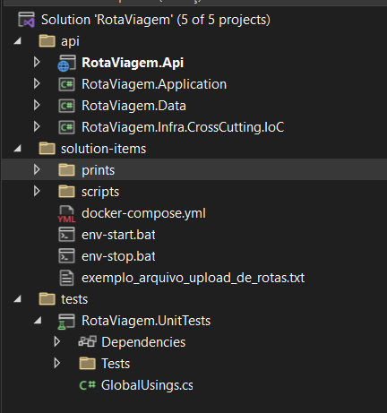

# Rota Viagens

## Estrutura projeto (Visual Studio)

## Decisões de design

A solução desenvolvida contempla os seguintes componentes:

### Serviço para Controle de Lançamentos

- API NET 8: possui um endpoint para gravar no banco de dados SQL Server e disparar um evento de atualização do Serviço de Consolidado Diário via fila
- Banco de dados SQL Server: armazena todos os lançamentos diários
- RabbitMQ Producer: consolida os saldos diários e envia uma mensagem para a fila solicitando a atualização do cache Redis (evento disparado via MediatR)

### Serviço de Consolidado Diário

- API NET 8: possui um endpoint para ler o saldo de um dia específico
- RabbitMQ Consumer: lê as mensagens da fila no RabbitMQ (via BackgroundService)
- Cache Redis: armazena todos os saldos diários

## Instruções para execução da aplicação

Pré-requisitos:

- Docker e Docker Compose instalados

Para iniciar a aplicação pela primeira vez, basta:

- [Iniciar aplicação executando o arquivo 'env-start.bat'](solution-items/env-start.bat)
- [Executar o script de criação de banco de dados no SQL Server](solution-items/scripts/init.sql)

Informações para acesso:

- SQL Server: localhost:1433 (user:sa | pass: 123Aa321 | database: RotaViagem)
- API: 127.0.0.1:5001/swagger/index.html ou localhost:5001/swagger/index.html

Para parar a aplicação, basta:

- [Parar aplicação executando o arquivo 'env-start.bat'](solution-items/env-stop.bat)
