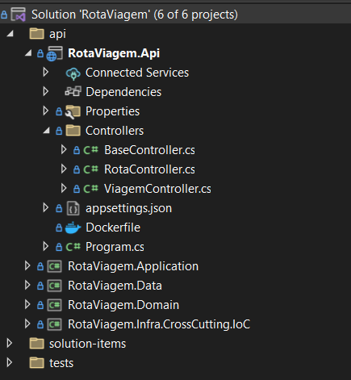
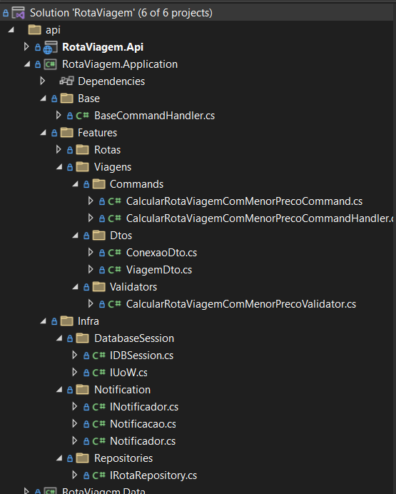
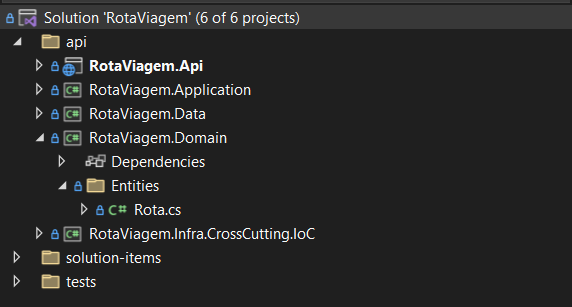
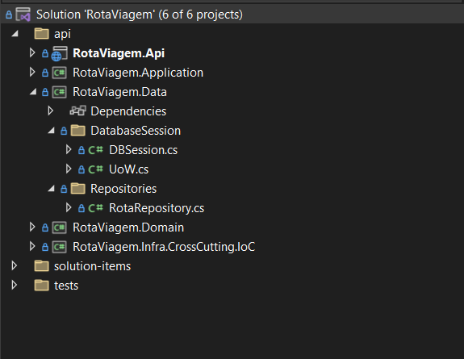
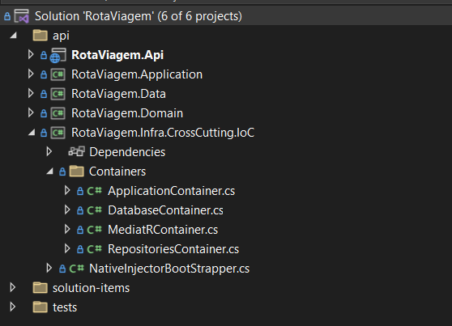
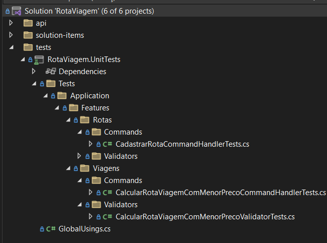
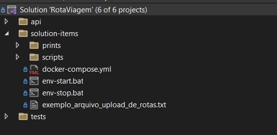

# Rota Viagens

Este projeto é a resolução de um desafio técnico, parte do processo seletivo para integração na equipe de desenvolvimento de software do Banco Master.
Abaixo descreverei pontos importantes levados em consideração para o desenvolvimento desta solução e as instruções para a execução do sistema.

## Decisões de design

Seguem abaixo a descrição das decisões de design adotadas para a realização do teste técnico.

### Clean Architecture

Foi a abordagem escolhida por ser a que dá mais ênfase à lógica de casos de uso do sistema. Por se tratar de um sistema pequeno, sem um domínio complexo e sem a necessidade momentânea de integrações complexas, embora haja potencial disso evoluir futuramente, a Clean Architecture atende bem ao cenário proposto no teste.

A Clean Architecture organiza o código de forma a torná-lo altamente modular, testável e independente de detalhes externos, como frameworks, bancos de dados e interfaces de usuário. Ela usa princípios como:

- Independência de Camadas: Camadas internas não dependem de camadas externas, mas o contrário é permitido. Regras de negócios (features/use cases) não conhecem detalhes técnicos como bancos de dados ou APIs.
- Inversão de Dependência: Camadas internas definem interfaces (contratos) que são implementadas pelas camadas externas. A comunicação entre as camadas deve seguir a direção das camadas mais externas para as mais internas.
- Modularidade: Cada camada tem uma responsabilidade bem definida, facilitando manutenção e adição de novas funcionalidades.
- Testabilidade: As camadas internas (casos de uso e entidades) são isoladas, permitindo testes unitários independentes de dependências externas.
- Flexibilidade: Troca de frameworks ou tecnologias (ex.: mudar banco de dados ou UI) sem impacto no núcleo do sistema.
- Estrutura de diretórios: Possui uma estrutura de diretórios bem organizada. Pastas separadas para cada camada (domain, data, aplicattion...) e padrões de nomenclatura claros.
- Evolução do Código: Facilita a refatoração e a evolução do projeto. Minimiza o impacto de mudanças. Serve como ponto de partida para utilizar outras abordagens mais robustas como Onion Architecture ou Hexagonal (Ports and Adapters).

### Bibliotecas

Abaixo segue a listagem de bibliotecas auxiliares utilizadas e a justificativa de uso, visando maior produtividade e simplificação do código:

- Dapper: Micro ORM de alto desempenho. Mais leve e rápido que ORMs completos como o Entity Framework, especialmente para operações simples. Ideal para cenários onde o controle total sobre as consultas SQL é necessário, mas ainda se deseja mapear resultados diretamente para objetos C#.
- FluentValidation: Simplifica a validação de dados com uma sintaxe fluente e intuitiva. Separa as regras de validação, promovendo o princípio de separação de responsabilidades (SRP) do SOLID.
- MediatR: Reduz o acoplamento entre diferentes partes do sistema, promovendo a comunicação por meio de mensagens. Melhora a testabilidade, pois desacopla o fluxo de execução de ações no sistema. Facilita a implementação de um design baseado em CQRS e orientado a eventos.
- Swashbuckle.AspnetCore: Integrar a documentação Swagger ao AspnetCore. Simplifica o teste e a integração da API com ferramentas externas.
- xUnit: Biblioteca de teste de unidade amplamente utilizada na comunidade .NET. Suporta recursos avançados, como fixtures e compartilhamento de contexto entre testes. Leve, flexível e facilmente integrado com ferramentas de CI/CD.
- Moq: Permite simular o comportamento de dependências externas, como repositórios, serviços ou APIs.

### Docker e Docker Compose

O Docker é uma plataforma que permite empacotar aplicações e suas dependências em contêineres, garantindo portabilidade entre diferentes ambientes (desenvolvimento, teste e produção). É leve e eficiente, utilizando menos recursos do que máquinas virtuais. Fornece um ambiente isolado e replicável, permitindo que a aplicação .NET Core seja executada da mesma forma em qualquer lugar, desde máquinas locais até servidores na nuvem.

O Docker Compose complementa o Docker ao permitir a orquestração de múltiplos contêineres. É possível definir serviços como API, banco de dados e cache, configurando portas, variáveis de ambiente e redes. Isso facilita a implantação, execução e o gerenciamento de ambientes completos com comandos simples.

### Estrutura de diretórios

#### API

Possui as controllers, com as chamadas para as features/use cases do sistema.

#### Application

Mantém a lógica de negócio de cada feature/use case do sistema. As features estão organizadas por entidades de domínio do negócio.

#### Domain

Aqui são implementadas as classes que representam entidades, value objects e outras regras específicas do domínio da aplicação.

#### Data

Representa as classes que realizam acesso ao banco de dados e realizam as operações de leitura e escrita.

#### Infra CrossCutting

Implementa os injeções de dependência e recursos comuns a todas as camadas da aplicação.

#### Tests

Implementa os testes da aplicação.

#### Solution Items

Possui os arquivos necessários para preparação de ambiente de desenvolvimento e manutenção de documentação.

## Instruções para execução da aplicação

Pré-requisitos:

- Docker e Docker Compose instalados

Para iniciar a aplicação pela primeira vez, basta:

- [Iniciar aplicação executando o arquivo 'env-start.bat'](solution-items/env-start.bat)
- [Executar o script de criação de banco de dados no SQL Server](solution-items/scripts/init.sql)
- [Acessar a URL da documentação Swagger da API via browser](localhost:5001/swagger/index.html)

Informações para acesso a recursos:

- SQL Server: (server: localhost | port: 1433 | user:sa | password: 123Aa321 | database: RotaViagem)
- API: 127.0.0.1:5001/swagger/index.html ou localhost:5001/swagger/index.html

Para parar a aplicação, basta:

- [Parar aplicação executando o arquivo 'env-start.bat'](solution-items/env-stop.bat)
